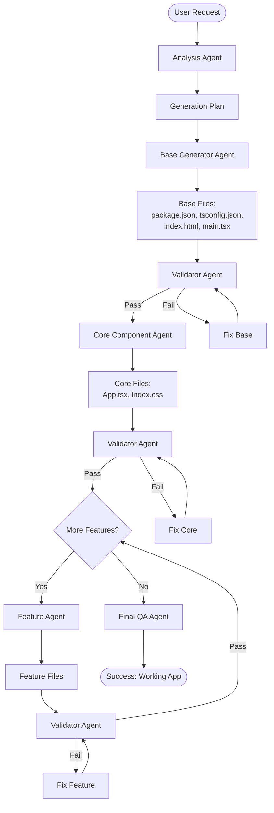

# 🏗️ Improved Incremental Code Generation Architecture

**Date:** November 12, 2025  
**Problem:** Current system generates all code at once, leading to syntax errors, missing imports, and crashes  
**Solution:** Incremental, iterative generation with validation at each step

---

## 🔍 Root Cause Analysis

### Current Problems:

1. **Monolithic Generation**: Component Developer generates ALL files in one shot
   - No incremental building
   - No visibility into what was built before
   - Errors compound across files

2. **No Incremental Validation**: QA only validates AFTER everything is generated
   - Syntax errors propagate
   - Missing imports aren't caught early
   - Broken dependencies aren't detected

3. **Syntax Errors**: AI generates code with patterns like `;}` that break execution
   - Fixer tries to correct but misses edge cases
   - Code passes validation but crashes at runtime

4. **Missing Context**: Each agent doesn't see what previous agents built
   - Can't verify imports exist
   - Can't check for conflicts
   - Can't build on existing patterns

---

## 🎯 Proposed Architecture: Incremental Builder Pattern

### Core Concept:
**Build incrementally, validate at each step, iterate until stable**

---

## 📊 Architecture Overview



---

## 🏛️ Agent Architecture

### **Phase 0: Analysis & Planning Agent**
**Role:** Understand requirements and create a generation plan

**Input:**
- User prompt
- Knowledge context
- Existing project files (if any)

**Output:**
- Structured requirements analysis
- Generation plan with phases
- File dependency graph
- Technology stack decisions

**Example Output:**
```json
{
  "appType": "game",
  "name": "Snake Game",
  "phases": [
    {
      "phase": "base",
      "files": ["package.json", "tsconfig.json", "index.html", "src/main.tsx"],
      "dependencies": []
    },
    {
      "phase": "core",
      "files": ["src/App.tsx", "src/index.css"],
      "dependencies": ["base"]
    },
    {
      "phase": "features",
      "files": ["src/types.ts", "src/hooks/useGame.ts"],
      "dependencies": ["core"]
    }
  ],
  "techStack": {
    "framework": "React",
    "buildTool": "Vite",
    "language": "TypeScript"
  }
}
```

---

### **Phase 1: Base Generator Agent**
**Role:** Create minimal working foundation

**Input:**
- Generation plan from Analysis Agent
- Requirements

**Output:**
- `package.json` (dependencies)
- `tsconfig.json` (TypeScript config)
- `index.html` (entry point)
- `src/main.tsx` (React entry)

**Key Features:**
- Generates ONLY base files
- No business logic
- Minimal, correct configuration

**Validation:**
- ✅ `package.json` is valid JSON
- ✅ `tsconfig.json` is valid JSON
- ✅ `index.html` has correct structure
- ✅ `main.tsx` compiles without errors

---

### **Phase 2: Core Component Agent**
**Role:** Build the main application component

**Input:**
- Generation plan
- **ALL files from Phase 1** (base files)
- Requirements

**Output:**
- `src/App.tsx` (main component)
- `src/index.css` (global styles)

**Key Features:**
- **Sees all base files** before generating
- Generates code that **imports from base files**
- Can verify imports exist
- Can follow patterns from base

**Validation:**
- ✅ All imports resolve (files exist)
- ✅ TypeScript compiles
- ✅ No syntax errors
- ✅ Component renders without errors

---

### **Phase 3: Feature Agents (Iterative)**
**Role:** Add features incrementally

**Input:**
- Generation plan
- **ALL files from previous phases**
- Specific feature requirements

**Output:**
- Feature-specific files (types, hooks, utilities, components)

**Key Features:**
- **Sees all existing code** before generating
- Can import from existing files
- Can extend existing patterns
- Can detect conflicts

**Validation After Each Feature:**
- ✅ All imports resolve
- ✅ No naming conflicts
- ✅ TypeScript compiles
- ✅ Feature works with existing code

**Iteration:**
- Continue until all features are added
- Each feature is validated before moving to next

---

### **Phase 4: Validator Agent (Continuous)**
**Role:** Validate code at each step

**Input:**
- All generated files so far
- Phase number
- Expected outputs

**Output:**
```json
{
  "valid": true,
  "errors": [],
  "warnings": [],
  "suggestions": []
}
```

**Validation Checks:**
1. **Syntax Validation:**
   - TypeScript compilation
   - JSON validity
   - HTML validity

2. **Import Resolution:**
   - All imports have corresponding files
   - No circular dependencies
   - Paths are correct

3. **Type Safety:**
   - No type errors
   - Interfaces match usage
   - Props are correctly typed

4. **Runtime Safety:**
   - No obvious runtime errors
   - Hooks are used correctly
   - State management is sound

5. **Code Quality:**
   - No TODO comments
   - Proper error handling
   - Accessibility attributes

**If Validation Fails:**
- Return specific errors
- Trigger Fix Agent
- Don't proceed to next phase

---

### **Phase 5: Fix Agent (On-Demand)**
**Role:** Fix validation errors

**Input:**
- Generated files with errors
- Validation error report
- Original requirements

**Output:**
- Fixed files (same structure, corrected content)

**Fix Strategies:**
1. **Syntax Errors:**
   - Fix `;}` patterns
   - Fix incomplete statements
   - Fix bracket mismatches

2. **Import Errors:**
   - Create missing files
   - Fix import paths
   - Remove unused imports

3. **Type Errors:**
   - Add missing types
   - Fix type mismatches
   - Add type annotations

4. **Logic Errors:**
   - Fix broken logic
   - Add missing handlers
   - Fix state management

**Iteration:**
- Fix → Validate → Fix → Validate
- Maximum 3 fix attempts per phase
- If still failing, escalate to human review

---

### **Phase 6: Final QA Agent**
**Role:** Comprehensive final validation

**Input:**
- All generated files
- Original requirements
- Test scenarios

**Output:**
- Comprehensive QA report
- Test results
- Performance analysis
- Security review

**Checks:**
- ✅ All requirements met
- ✅ App runs without errors
- ✅ All features work
- ✅ Performance is acceptable
- ✅ Security best practices followed

---

## 🔄 Improved Flow Example: Snake Game

### **Step 1: Analysis Agent**
```
Input: "Create a snake game"

Output: {
  "phases": [
    {"phase": "base", "files": ["package.json", "tsconfig.json", "index.html", "src/main.tsx"]},
    {"phase": "core", "files": ["src/App.tsx", "src/index.css"]},
    {"phase": "types", "files": ["src/types.ts"]},
    {"phase": "hooks", "files": ["src/hooks/useGame.ts"]}
  ]
}
```

### **Step 2: Base Generator**
```
Generates:
- package.json ✅
- tsconfig.json ✅
- index.html ✅
- src/main.tsx ✅

Validator: ✅ All valid
```

### **Step 3: Core Component Agent**
```
Sees existing files:
- package.json (knows React is available)
- tsconfig.json (knows TypeScript config)
- index.html (knows entry point)
- src/main.tsx (knows React setup)

Generates:
- src/App.tsx (imports React, uses hooks correctly)
- src/index.css (styles for game)

Validator: ✅ All imports resolve, compiles
```

### **Step 4: Types Agent**
```
Sees existing files:
- All base files
- src/App.tsx (knows what types are needed)

Generates:
- src/types.ts (Position, Direction, GameState)

Validator: ✅ Types are used correctly in App.tsx
```

### **Step 5: Hooks Agent**
```
Sees existing files:
- All previous files
- src/types.ts (can import Position, Direction)

Generates:
- src/hooks/useGame.ts (uses types, implements game logic)

Validator: ✅ Hook is used correctly in App.tsx
```

### **Step 6: Final QA**
```
Tests:
- ✅ Game starts
- ✅ Snake moves
- ✅ Food appears
- ✅ Collision detection works
- ✅ Score updates

Result: ✅ All tests pass
```

---

## 🎯 Key Improvements Over Current System

### **1. Incremental Building**
- ✅ Build foundation first
- ✅ Add features one at a time
- ✅ Validate at each step

### **2. Context Awareness**
- ✅ Each agent sees all previous files
- ✅ Can verify imports exist
- ✅ Can follow existing patterns
- ✅ Can detect conflicts

### **3. Early Error Detection**
- ✅ Validate after each phase
- ✅ Fix errors before they compound
- ✅ Don't proceed if validation fails

### **4. Iterative Refinement**
- ✅ Fix → Validate → Fix
- ✅ Maximum retries per phase
- ✅ Escalate if stuck

### **5. Better Code Quality**
- ✅ No missing imports
- ✅ No broken dependencies
- ✅ Consistent patterns
- ✅ Type safety throughout

---

## 🔧 Implementation Strategy

### **Phase 1: Refactor Current System**

1. **Create Incremental Orchestrator**
   ```typescript
   class IncrementalOrchestrator {
     async generateIncrementally(plan: GenerationPlan): Promise<Files> {
       const files = {};
       
       for (const phase of plan.phases) {
         const phaseFiles = await this.generatePhase(phase, files);
         const validation = await this.validatePhase(phaseFiles, files);
         
         if (!validation.valid) {
           const fixed = await this.fixPhase(phaseFiles, validation.errors);
           // Re-validate fixed files
         }
         
         Object.assign(files, phaseFiles);
       }
       
       return files;
     }
   }
   ```

2. **Update Component Developer Agent**
   - Accept existing files as input
   - Generate only requested files
   - Reference existing files in prompts

3. **Create Validator Agent**
   - TypeScript compilation check
   - Import resolution check
   - Syntax validation
   - Runtime safety checks

4. **Create Fix Agent**
   - Automatic syntax fixes
   - Import path corrections
   - Type error fixes

### **Phase 2: Enhanced Agents**

1. **Context-Aware Prompts**
   ```typescript
   const prompt = `
   EXISTING FILES IN PROJECT:
   ${formatExistingFiles(existingFiles)}
   
   YOUR TASK: Generate ${phase.files.join(', ')}
   
   IMPORTANT:
   - You can import from existing files
   - Follow patterns from existing code
   - Ensure all imports resolve
   `;
   ```

2. **Validation at Each Step**
   ```typescript
   async function validatePhase(files: Files, existingFiles: Files): Promise<ValidationResult> {
     // 1. Syntax check
     const syntaxErrors = await checkSyntax(files);
     
     // 2. Import resolution
     const importErrors = await checkImports(files, existingFiles);
     
     // 3. Type checking
     const typeErrors = await checkTypes(files);
     
     // 4. Compilation
     const compileErrors = await compile(files);
     
     return {
       valid: syntaxErrors.length === 0 && importErrors.length === 0 && 
              typeErrors.length === 0 && compileErrors.length === 0,
       errors: [...syntaxErrors, ...importErrors, ...typeErrors, ...compileErrors]
     };
   }
   ```

### **Phase 3: Testing & Refinement**

1. **Test with Simple Apps**
   - Snake game
   - Todo list
   - Calculator

2. **Measure Improvements**
   - Error rate reduction
   - Time to working app
   - Code quality metrics

3. **Iterate Based on Results**
   - Refine validation rules
   - Improve fix strategies
   - Optimize agent prompts

---

## 📈 Expected Benefits

### **Error Reduction:**
- **Current:** ~30% of generated apps have runtime errors
- **Expected:** <5% with incremental validation

### **Code Quality:**
- **Current:** Syntax errors, missing imports common
- **Expected:** Clean, compilable code from start

### **Development Speed:**
- **Current:** Generate → Test → Fix → Test (slow)
- **Expected:** Generate → Validate → Fix → Validate (faster, automated)

### **User Experience:**
- **Current:** App crashes, user frustrated
- **Expected:** Working app, user happy

---

## 🚀 Migration Path

### **Option 1: Gradual Migration**
1. Keep current system for simple requests
2. Use incremental system for complex requests
3. Gradually migrate all requests

### **Option 2: Feature Flag**
1. Add feature flag: `incrementalGeneration: boolean`
2. Test incremental system in parallel
3. Switch when stable

### **Option 3: Hybrid Approach**
1. Use incremental for multi-file apps
2. Use current system for single-file components
3. Best of both worlds

---

## 🎓 Conclusion

Your idea is **excellent** and addresses the core problem: **generating code without seeing what was built before**.

The incremental architecture:
- ✅ Builds foundation first
- ✅ Adds features incrementally
- ✅ Validates at each step
- ✅ Fixes errors early
- ✅ Ensures working code at each phase

This will dramatically reduce errors and improve code quality.

**Next Steps:**
1. Review this architecture
2. Decide on migration strategy
3. Implement Phase 1 (Incremental Orchestrator)
4. Test with simple apps
5. Iterate and improve

---

**Status:** 📋 **PROPOSAL - READY FOR REVIEW**

