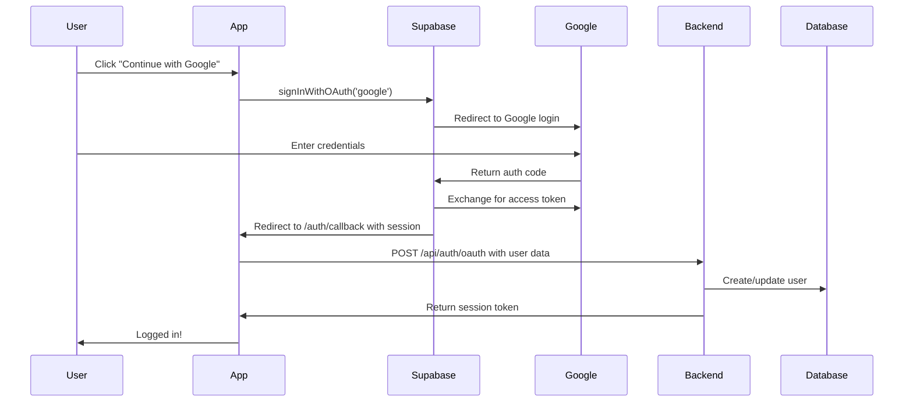

# OAuth Setup Guide (Supabase)

## Why Supabase Auth?

Supabase Auth provides:
- ✅ **Multiple OAuth providers** - Google, GitHub, Twitter, Facebook, etc.
- ✅ **Built-in security** - No need to manage tokens manually
- ✅ **Session management** - Automatic token refresh
- ✅ **Email verification** - Optional email verification flow
- ✅ **User metadata** - Profile pictures, names, etc.

## Setup Instructions

### 1. Create Supabase Project

1. Go to [supabase.com](https://supabase.com/)
2. Create a new project (free tier available)
3. Wait for database provisioning (~2 minutes)

### 2. Configure OAuth Providers

#### Google OAuth

1. Go to [Google Cloud Console](https://console.cloud.google.com/)
2. Create a new project (or select existing)
3. Enable **Google+ API**
4. Go to **Credentials** → **Create Credentials** → **OAuth 2.0 Client ID**
5. Application type: **Web application**
6. Authorized redirect URIs:
   ```
   https://[your-project-ref].supabase.co/auth/v1/callback
   ```
7. Copy **Client ID** and **Client Secret**

8. In Supabase Dashboard:
   - Go to **Authentication** → **Providers** → **Google**
   - Enable Google
   - Paste Client ID and Client Secret
   - Save

#### GitHub OAuth

1. Go to [GitHub Developer Settings](https://github.com/settings/developers)
2. Click **New OAuth App**
3. Fill in:
   - Application name: Your App Name
   - Homepage URL: `http://localhost:5173` (for development)
   - Authorization callback URL:
     ```
     https://[your-project-ref].supabase.co/auth/v1/callback
     ```
4. Copy **Client ID** and **Client Secret**

5. In Supabase Dashboard:
   - Go to **Authentication** → **Providers** → **GitHub**
   - Enable GitHub
   - Paste Client ID and Client Secret
   - Save

#### Apple OAuth (Sign in with Apple)

1. Go to [Apple Developer Portal](https://developer.apple.com/)
2. Sign in with your Apple Developer account (requires paid membership)
3. Go to **Certificates, Identifiers & Profiles**
4. Click **Identifiers** → **+** to create a new identifier
5. Select **Services IDs** → **Continue**
6. Fill in:
   - Description: Your App Name
   - Identifier: `com.yourcompany.yourapp` (unique identifier)
7. Enable **Sign in with Apple** → **Configure**
8. Add domains and subdomains:
   - Primary App Domain: `yourdomain.com`
   - Return URLs:
     ```
     https://[your-project-ref].supabase.co/auth/v1/callback
     ```
9. Save and continue
10. Go to **Keys** → **+** to create a new key
11. Enable **Sign in with Apple**
12. Download the key file (`.p8`) - **you can only download this once!**
13. Note the **Key ID** and **Team ID**

14. In Supabase Dashboard:
    - Go to **Authentication** → **Providers** → **Apple**
    - Enable Apple
    - Fill in:
      - **Services ID**: The identifier you created (e.g., `com.yourcompany.yourapp`)
      - **Secret Key**: The contents of the `.p8` file you downloaded
      - **Key ID**: The Key ID from Apple Developer Portal
      - **Team ID**: Your Apple Team ID
    - Save

**Note**: Apple OAuth requires an active Apple Developer Program membership ($99/year).

#### Facebook OAuth

1. Go to [Facebook Developers](https://developers.facebook.com/)
2. Sign in with your Facebook account
3. Click **My Apps** → **Create App**
4. Select **Consumer** as the app type → **Next**
5. Fill in:
   - App Display Name: Your App Name
   - App Contact Email: Your email
   - Business Account: (Optional) Select if you have one
6. Click **Create App**
7. In the app dashboard, go to **Settings** → **Basic**
8. Add **App Domains**:
   - For development: `localhost`
   - For production: `yourdomain.com`
9. Click **+ Add Platform** → Select **Website**
10. Add **Site URL**:
    - For development: `http://localhost:5173`
    - For production: `https://yourdomain.com`
11. Go to **Facebook Login** → **Settings**
12. Add **Valid OAuth Redirect URIs**:
    ```
    https://[your-project-ref].supabase.co/auth/v1/callback
    ```
13. Go to **Settings** → **Basic** and note:
    - **App ID**
    - **App Secret** (click **Show** to reveal)

14. In Supabase Dashboard:
    - Go to **Authentication** → **Providers** → **Facebook**
    - Enable Facebook
    - Paste **App ID** and **App Secret**
    - Save

**Note**: 
- Facebook requires app review for certain permissions in production
- For development, you can use the app in "Development Mode" without review
- Make sure to add test users in Facebook App Dashboard for testing

### 3. Get Supabase Credentials

In your Supabase Dashboard:
1. Go to **Settings** → **API**
2. Copy:
   - **Project URL** (e.g., `https://xxx.supabase.co`)
   - **anon/public** key

### 4. Configure Environment Variables

Add to your `.env` file:

```bash
# Supabase Auth
VITE_SUPABASE_URL=https://your-project-ref.supabase.co
VITE_SUPABASE_ANON_KEY=your_anon_key_here
```

### 5. Update Redirect URLs for Production

When deploying to production:

1. Add production URL to OAuth providers:
   - Google: `https://your-domain.com` as authorized origin
   - GitHub: `https://your-domain.com` as homepage URL

2. Update Supabase redirect URL in code if needed (currently auto-detected)

### 6. Test OAuth Flow

1. Start your dev server: `npm run dev`
2. Click "Login" in your app
3. Click "Continue with Google" or "Continue with GitHub"
4. Complete OAuth flow
5. You should be redirected back and logged in!

## How It Works



## Security Considerations

1. **Session Storage**: Sessions are stored in localStorage (handled by Supabase)
2. **Token Refresh**: Automatic token refresh (1 hour default)
3. **HTTPS Required**: OAuth won't work on HTTP in production
4. **CORS**: Already configured in backend

## Troubleshooting

### "OAuth not configured"
- Check that `VITE_SUPABASE_URL` and `VITE_SUPABASE_ANON_KEY` are set
- Restart your dev server after adding env vars

### "Redirect URI mismatch"
- Ensure the redirect URI in your OAuth provider matches exactly:
  ```
  https://[your-project-ref].supabase.co/auth/v1/callback
  ```

### "Failed to register OAuth user"
- Check backend logs for detailed error
- Ensure database tables exist (run migrations if needed)

### User redirected but not logged in
- Check browser console for errors
- Verify `/auth/callback` route is registered in your router
- Check that `/api/auth/oauth` endpoint is accessible

## Custom OAuth Providers

To add more providers (Twitter, Facebook, etc.):

1. Enable in Supabase Dashboard
2. Get provider credentials
3. Add to `signInWithOAuth` function in `client/src/lib/supabase.ts`
4. Add button to `AuthDialog.tsx`

### Apple OAuth Notes

- **Requires Apple Developer Account**: Sign in with Apple requires an active Apple Developer Program membership
- **Email Privacy**: Apple may hide user emails. Users can choose to share their real email or use Apple's private relay email
- **Testing**: You can test Apple OAuth in development, but it works best in production with a verified domain
- **Domain Verification**: Apple requires domain verification for production use

## Production Checklist

- [ ] OAuth provider credentials configured for production domain
- [ ] Supabase redirect URLs updated for production
- [ ] Environment variables set in deployment platform
- [ ] HTTPS enabled on production domain
- [ ] Test OAuth flow on production
- [ ] Monitor Supabase auth logs

## Cost

Supabase Free Tier:
- 50,000 monthly active users
- Unlimited OAuth logins
- Unlimited API requests

Perfect for getting started!

